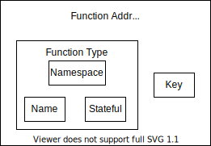

## Phase 1: Code Analysis
In the first phase of this conversion, we analyze the AST of the class definitions and extract all necessary information to initialize a dataflow. For this code analysis, we consider **classes**, **(stateless) functions** and **lambda's**.
### Classes
Classes will eventually be turned into stateful functions. The following information will be extracted and stored in a `ClassDescriptor`:
1. **State extraction**   
In each `FunctionDef` we look for all attributes associated with `self`. All `self` attributes are extracted and merged, prioritizing typed declarations.
This approach assumes that __all__ state of a class, is assigned (or defined) at least once somewhere in the functions of the classes.
2. **Method extraction**   
In each `ClassDef`, we look for all the `FunctionDef` which will be analyzed and result in a `MethodDescriptor`. 
For each method we extract:
    - Method input: The parameters of a function are stored in a `InputDescriptor`. 
         - For method parameters we do not allow _default_ values nor `*args` and `**kwargs`.
         - If a parameter has a call or attribute access, we need the type of the parameter to be defined.
    - Method output: The output of a function is stored in a `OutputDescriptor`. Since a method can have multiple 'return paths', the OutputDescriptor holds a list of potential returns. We don't care about the variable names that are returned, so we only store the _amount_ of return variables and potentially the types. 
         - If a return annotation is given, each return statement needs to match this annotation in terms of length.
         - No function calls are allowed in a return statement. 
    - Read-only: we extract if a function is read or write (to state). I.e. assignments to `self` is done. 

Lastly, we have some _restrictions_ for a class:
- Functions cannot be `async`. It does not make sense in the context of StateFlow where functions are already running completely asynchronous.
- There can't be functions with the same name. Similar to Python behaviour, we just pick the latest function declaration.
- The `__init__` method is a special method that always needs to be declared and we do not allow any function calls there OR parameters of other functions.
- A class has to define a `__hash__` function to decide on the `key` of the stateful functions. **TODO**: what are the restrictions of this hash func.

## Execution
For the execution part we wrap a `ClassDescriptor` into a `ClassWrapper`. Effectively, this wrappers stores a reference to the actual class and a reference to the `ClassDescriptor`.
A `ClassDescriptor` holds references to all `MethodDescriptor`'s. This wrapper is used to invoke a method on the class, for this we distinguish two type of invocations:
- `invoke(self, method_name: str, state: State, arguments: Arguments) -> InvocationResult`  
This is a normal invoke, in which we select a method, the state of the class and the method arguments. In case of a successful invocation a `InvocationResult` is returned.
  This holds the updated state of the class and the returned variables. In case of failure, a `FailedInvocation` is returned. This invoke method verifies if the given method name, state and arguments match that of the method to be invoked.
- `init_class(self, arguments: Arguments) -> InvocationResult`   
This is a special case of invoke, in which we initialize the class whereas it has not been created before. Therefore no state is available yet. This method returns an `InvocationResult`
  with the initialized state, and the key of instance. 
  
## Function Address
Similar to stateful functions by Flink, functions are addressable by their `FunctionAddress`. Our `FunctionAddress` is very similar to the one used by Flink, except that we already have a flag for stateful functions.
Flink does not have the notion of a stateless function. The FunctionAddress holds a FunctionType and a key. See the image below:  

The function address consists of two parts:
- The function type: name and namespace of a function and a (boolean) flag for if it's stateful or not. The namespace is used to deal with naming conflicts. 
- The key: this key is used to identify an instance of a function. That is, a key which uniquely identifies a piece of state bound to a (stateful) function. For a stateless function this key is None.
